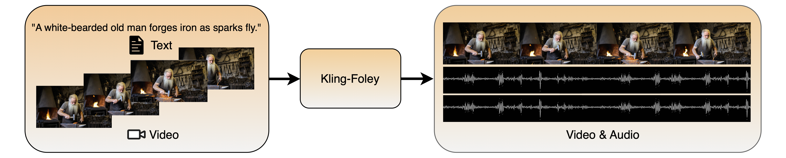

<h1 align="center">Kling-Foley: Multimodal Diffusion Transformer for High-Quality Video-to-Audio Generation</h1>

<div align='center'>
  <span class="author-block">Jun Wang<sup>*</sup>, Xijuan Zeng<sup>*</sup>, Chunyu Qiang<sup>*</sup>, Ruilong Chen, Shiyao Wang, Le Wang, Wangjing Zhou, Pengfei Cai, Jiahui Zhao</span>
  <span class="author-block">Nan Li, Zihan Li, Yuzhe Liang, Xiaopeng Wang, Haorui Zheng, Ming Wen, Kang Yin, Yiran Wang</span>
  <span class="author-block">Nan Li, Feng Deng, Liang Dong, Chen Zhang, Di Zhang, Kun Gai</span>
</div>

<div align='center'>
  <span class="author-block"><strong>Kuaishou Technology</strong></span>
</div>
<br>

<div align="center">

  <!-- 📄 Paper / project / GitHub stats -->
  <p>
    <a href="https://arxiv.org/abs/2506.19774" target="_blank"></a>&nbsp;
    <a href="https://klingfoley.github.io/Kling-Foley/" target="_blank"></a>&nbsp;
    <a href="https://huggingface.co/datasets/klingfoley/Kling-Audio-Eval" target="_blank"></a>&nbsp;
    &nbsp;
    <a href="https://github.com/klingfoley/Kling-Foley" target="_blank"></a>
  </p>

  <!-- 🎬 Showcase -->
  <p></p>
  <p>🔥 For more results, visit our <a href="https://klingfoley.github.io/Kling-Foley/" target="_blank"><strong>homepage</strong></a> 🔥</p>

</div>

## Introduction 📖
We propose Kling-Foley, a large-scale multimodal Video-to-Audio generation model. Taking an input video and an optional text prompt, the model synthesizes high-fidelity audio that is semantically aligned and temporally synchronized with the video content, encompassing elements such as sound effects and background music. Significantly, Kling-Foley can produce audio sequences of arbitrary duration, dynamically adapting to the length of the input video.

## Benchmark
We also open-source an industrial-level benchmark Kling-Audio-Eval on [HuggingFace](https://huggingface.co/datasets/klingfoley/Kling-Audio-Eval) 🤗 .
The evaluation code is from [av-benchmark](https://github.com/hkchengrex/av-benchmark.git).
 
## Citation
```
@misc{klingfoley,
      title={Kling-Foley: Multimodal Diffusion Transformer for High-Quality Video-to-Audio Generation},
      author={Jun Wang, Xijuan Zeng, Chunyu Qiang, Ruilong Chen, Shiyao Wang, Le Wang, Wangjing Zhou, Pengfei Cai, Jiahui Zhao, Nan Li, Zihan Li, Yuzhe Liang, Xiaopeng Wang, Haorui Zheng, Ming Wen, Kang Yin, Yiran Wang, Nan Li, Feng Deng, Liang Dong, Chen Zhang, Di Zhang, Kun Gai},
      journal={arXiv preprint arXiv:2506.19774},
      year={2025}
}
```